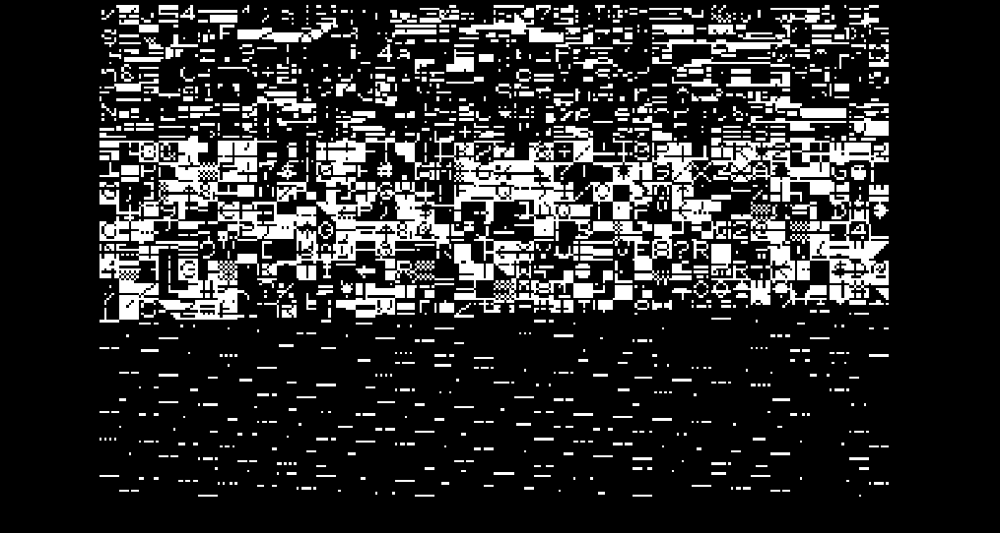

# PET-Digital-Simulation

## About

This is an (almost) complete logic-level simulation of the Commodore PET Computer using the [Digital](https://github.com/hneemann/Digital) logic circuit simulator.

It is based on the [original schematics](https://www.zimmers.net/anonftp/pub/cbm/schematics/computers/pet/2001N/320349.pdf) which are recreated page by page.

*PET2001-32N/CBM3032 Schematic*

*PET2001-4 Schematic*

It can be used to analyze and understand how this computer and its components works down to single logic elements, and to see how simple (or complex) of a circuit is required to make a fairly simple computer as the PET tick.

It might also help in troubleshooting real PETs by comparing the (hopefully) correct signals of the simulation to signals on the faulty computer.

And it was fun to make.

## Requirements

To run this simulation the Digital Simulator by Helmut Neemann is required. It can be downloaded [here](https://github.com/hneemann/Digital/releases/latest/download/Digital.zip).

After starting Digital a Plugin containing the simulation code for the 6502 CPU and some other special chips needs to be loaded into Digital.

Go to `Edit`->`Settings`->`Advanced`->`Java Library` and select the "PETComponentsDigitalPlugin.jar" file which is included in the PET Simulator.

After adding the plugin a restart is required.

The source for the [PETComponentsDigitalPlugin](https://github.com/innot/PETComponentsPlugin) as well as the underlying [6502/6520/6522](https://github.com/innot/Sim6502Java) simulations are also on Github.

## Starting the Simulation

From Digital open the file `Mainboard-CBM3032.dig` to start the dynamic PET simulation.
Or `Mainboard-PET2001-4.dig` for the original PET simulation.

The simulation can be started immediately by pressing the ▶ button on the upper toolbar.

Once started, a window for the screen output and a keyboard input box pop up to interact with the system.

Caveat: If you cannot find the Keyboard Input box, it is probably hidden behind the screen output window.

The speed of the simulation is controlled by the 16MHz (PET2001N/CBM3032) resp. 8MHz (PET2001-4) clock component in the DEBUG frame.

A right click opens a dialog box where the simulated speed can be selected. Please note,that this is the (simulated) speed of the nominal 16MHz/8MHz quartz crystal of the original PET. The 6502 CPU runs at just 1/16th or 1/8th of this clock (nominal 1MHz).

Deselect the `Start real time clock` checkmark to step through the simulation cycle-by-cycle by repeatedly clicking on the clock component.

In this mode it is also possible to set breakpoints on signals and run the simulation until a breakpoint is hit.

Further information on how to use the Digital Simulator can be found in its documentation (`HELP`->`Documentation`)

## Why?

This project was started after watching this [youtube video](https://www.youtube.com/watch?v=nxilekpLp6g) by [curiousmarc](https://www.youtube.com/@CuriousMarc), where he and [Ken Shirriff](https://www.righto.com/2025/04/commodore-pet-repair.html) repair a broken PET2001.

To follow the repairs I looked at the PET schematics - but got the wrong schematics. In the video they repair an original PET with static memory, not the dynamic memory used in my schematic.

But as I have always been curious about how dynamic RAM works, especially the refresh part, I decided to simulate the memory part to see how it works.

Once that was running in the simulator I was intrigued by the video circuit. Having started with computing in the era of video control chips (VIC20 to be precise), I have been fascinated by how video was generated with just logic chips without any specialized ICs.

After the video circuit was working and generating a valid image the decision was made to just implement the whole system and see if it could boot.

Which it can 😊

After the first version with the dynamic PET simulation was released I got a request to simulate the original PET as well. With the CPU, PIA and VIA components already finished it was not to much effort to do the original PET as well.

## PET Versions

This project contains two PET versions:

### PET2001N-32/CBM3032

also known as the "dynamic PET". In Europe this version was sold as the CBM3032.

This version was chosen because it uses dynamic RAM and, unlike the later 4000 and 8000 Series, the video output is generated only with conventional 74-series logic chips and not with a boring dedicated video controller chip.

This PET version runs BASIC 2.  
While it should be possible to use BASIC 4 ROMs, the BASIC 2 has the nice Microsoft Easter Egg and any of the newer BASIC 4 commands (like DLOAD etc.) are of no use in this simulator.

### The PET2001-4

also known as the "original PET" (with the chiclet Keyboard)

This version was added to the simulation because it is often the target of restoration projects. It is simpler in design (though with horrible schematics) and due to the 8MHz clock the simulation runs twice as fast.

It has BASIC 1 with all its quirks and bugs.

## Speed

This PET2001N/CBM3032 simulation has currently about 580 logic elements, whose state needs to be calculated multiple times for every change of the main clock signal (a 16 MHz clock) as the signals propagate through them.
Additionally there are the screen updates which happen multiple times a second.

In other words this simulation is slow and far from running in realtime.

On my development machine (a 2019 vintage Core i7-8565U @ 1.80 GHz) the simulation runs at about 200 kHz (200.000 cycles of the 16MHz clock per second) resulting in about 1.25% or 1/80th of the original speed.

So trying to run anything on the simulated PET requires quite a bit of patience. Even getting to the BASIC ready prompt takes about 2 minutes.

The speed could probably be improved a bit by dropping schematics accuracy and replacing components with faster substitutes - e.g. replacing the 16 RAM chips with a single RAM simulation. But the goal of this simulation is schematic accuracy, not speed 😊

The PET2001 simulation runs faster because it only has to simulate 8 system clock cycles for every CPU clock cycle. Also with fewer RAM to check the system gets much faster to the BASIC ready prompt.

## Compatibility

The simulated systems are fairly compatible with their real counterparts.

### PET2001N / CBM3032

It can run the TIM (Terminal Interface Monitor) by executing
> SYS1024

It can change to lowercase letters with
> POKE59468,14

And it contains the Microsoft easter egg 😁

But it runs only part of the official Commodore Diagnostic Software and has a bug generating the correct 60Hz IRQ signal.

### Original PET2001

The simulation of the original PET is also fairly accurate. It even shows the video sparkles when the CPU accesses the screen RAM

Which are very visible during the boot when clearing the screen memory

Also the included BASIC V1 has the "PEEK Protection" of the BASIC ROMs

But the Diagnostic ROM also fails, showing a BAD VIDEO message on the VIDEO TEST.

## Bugs

The simulation has some known bugs:

- PET2001N/CBM3032: Connecting the DO (Data Output) pins of the upper 16k RAM bank to corresponding pins of the lower bank causes spurious short circuits which will stop the simulation. The problem probably lies somewhere within the simulated RAM logic. This is currently fixed by disconnecting the DO pins of the upper bank from the system. On the plus side, this reduces boot time by about 2 minutes as the system RAM check only takes half as long.

- The IEEE-488 Interface is not implemented. While this could be added reasonably easy, some kind of simulated IEEE-488 device would be required to make the effort worthwhile. And that part is definitely non-trivial.

- PET2001N/CBM3032:The Diagnostic ROM fails when testing the 60Hz IRQ, even though the IRQ signal is present.

- PET2001: The Diagnostic ROM fails during the VIDEO TEST.

## TODOs

- Fix the Bugs
- PET2001N/CBM3032: Implement the 4116 RAM chips with a custom component to make them faster and more reliable.
- Maybe add a simulated cassette drive to save and load programs (but this would be extremly slow)
- Some other interesting systems like the Apple 1

## Conclusion

If you do like this project give it a star or leave a comment on the [discussions](https://github.com/innot/PET-Digital-Simulation/discussions) page.
If you do find a bug or have an idea for an improvement feel free to raise an [issue](https://github.com/innot/PET-Digital-Simulation/issues).
And finally you can head over to my blog [start-a-dozen](https://start-a-dozen.com/) where I plan to write some in-detail descriptions of the PET Circuit.

